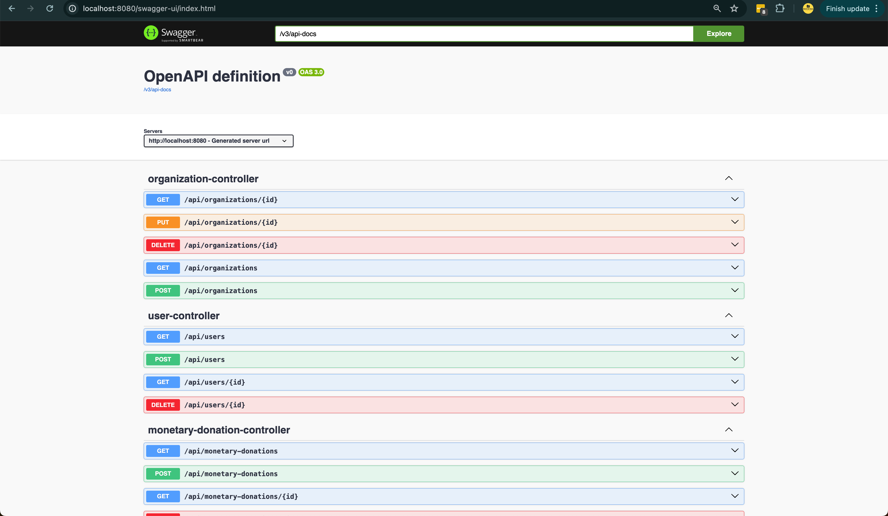

# Red Drop API

[](https://github.com/ramialkaro/red-drop-api/actions)
[](https://coveralls.io/github/ramialkaro/red-drop-api?branch=main)

Red Drop API is a comprehensive donation application designed to facilitate blood and monetary donations. It provides RESTful endpoints for managing donors, receivers, donations, and organizations. This API is built using Spring Boot and supports both H2 database for local setup and PostgreSQL for production environments.

## Features

- Manage donors and receivers
- Track blood and monetary donations
- View and update organization details
- Check blood type compatibility
- Create and manage users
- Comprehensive testing with over 85% test coverage
- Swagger for API documentation

## Getting Started

### Prerequisites

- Java 21
- Maven
- PostgreSQL (optional, for production setup)

### Local Setup

1. **Clone the repository:**

   ```bash
   git clone https://github.com/ramialkaro/red-drop-api.git
   cd red-drop-api
   ```

2. **Run the application:**

   ```bash
   mvn spring-boot:run
   ```

   By default, the application uses an H2 in-memory database for local development.

3. **Access H2 Console:**
   - URL: `http://localhost:8080/h2-console`
   - JDBC URL: `jdbc:h2:mem:testdb`
   - Username: `sa`
   - Password: `password`

### Production Setup

1. **Configure PostgreSQL:**
   Update the `application.properties` or `application.yml` with your PostgreSQL configuration.

   ```properties
   spring.datasource.url=jdbc:postgresql://localhost:5432/reddrop
   spring.datasource.username=your_username
   spring.datasource.password=your_password
   spring.jpa.hibernate.ddl-auto=update
   ```

2. **Run the application:**
   ```bash
   mvn spring-boot:run
   ```

### Docker Setup

1. Make sure to setup Docker Engine locally https://docs.docker.com/engine/
2. Run the following command to spin a instance
   ```bash
   docker-compose up
   ```

## API Documentation

The Red Drop API uses Swagger for API documentation. Once the application is running, you can access the Swagger UI at:

```
http://localhost:8080/swagger-ui.html
```



## Running Tests

To run the tests and check the coverage, use the following command:

```bash
mvn test
```

Test coverage reports are generated and can be viewed in the `target/site/jacoco` directory.

## GitHub Actions

This project uses GitHub Actions for CI/CD. The configuration file is located at `.github/workflows/maven.yml` and includes steps for building the project and running tests.

## Project Structure

- **Controller Layer:** Handles incoming HTTP requests and responses.
- **Service Layer:** Contains business logic.
- **Repository Layer:** Interacts with the database.
- **Model Layer:** Defines the data structures.

## Contributing

Contributions are welcome! Please fork the repository and submit a pull request.

1. **Fork the repository**
2. **Create a feature branch**
3. **Commit your changes**
4. **Push to the branch**
5. **Open a pull request**

## License

This project is licensed under the MIT License. See the [LICENSE](LICENSE) file for details.

---

Happy coding! Thank you for using Red Drop API.
